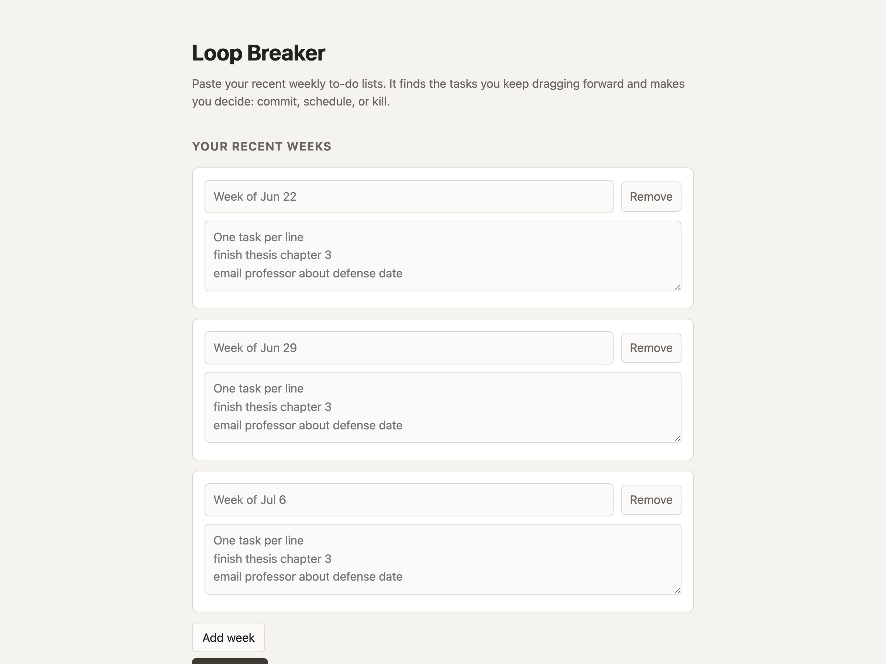
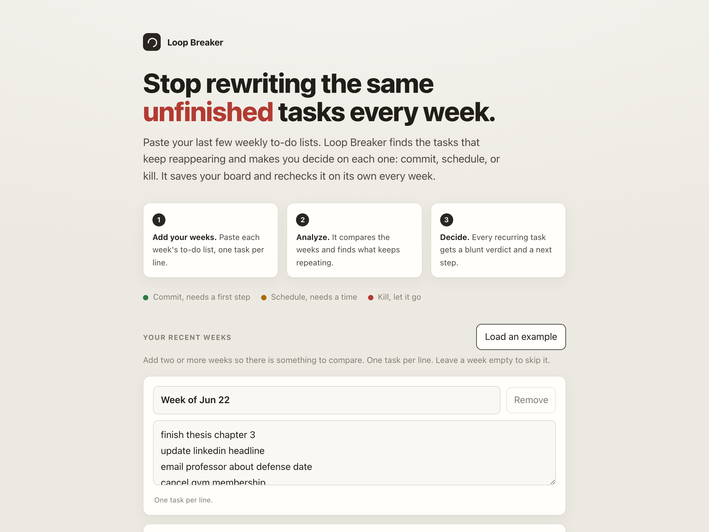
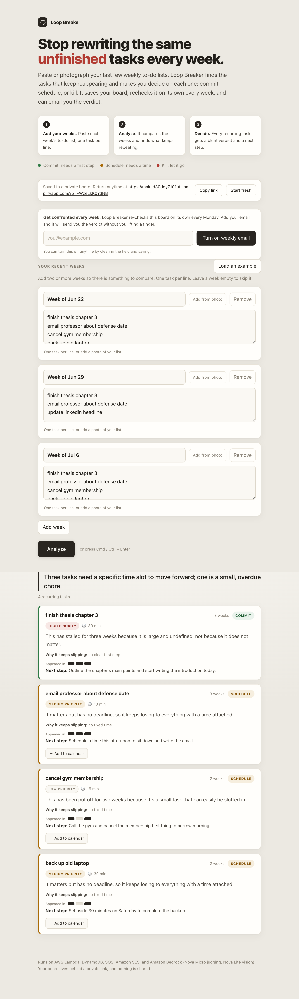

# Weekend Productivity Challenge: Loop Breaker

Loop Breaker is a serverless app that finds the tasks you keep copying from one weekly to-do list to the next, then makes you decide on each one: commit, schedule, or kill. It runs entirely on AWS. Amplify hosts the frontend, a single Lambda behind a function URL runs the backend, DynamoDB stores the boards, SQS and EventBridge Scheduler drive a weekly re-check, Amazon SES sends the results by email, and Amazon Bedrock does the judging with the Nova Micro and Nova Lite models.



## Vision & What the App Does

I have tried a lot of to-do systems, and they all failed me the same way. Every Sunday I wrote a fresh weekly list, and every week three or four tasks quietly walked across from the last one. "Finish thesis chapter 3." "Back up the old laptop." "Cancel the gym membership." They were never hard. They were vague, mildly unpleasant, or things I secretly did not intend to do. A normal to-do app is happy to let you carry a task forever. It never asks the obvious question: if this has been on your list for three weeks, what is actually going on?

Loop Breaker is my answer. You keep a running board of your recent weekly lists, and it finds the tasks that keep reappearing and refuses to let them sit there unnamed. For each one it gives a verdict and a reason:

- COMMIT when the task matters and the blocker is that it is vague or daunting, so it needs a concrete first step today.
- SCHEDULE when the task matters but keeps sliding for lack of a fixed time, so it needs a slot.
- KILL when the task does not matter enough to justify the space it keeps taking, and the honest move is to let it go.

Every card also carries a priority, a short line naming why that task keeps slipping, a rough effort estimate, and a first step you can act on. A small strip shows which weeks the task appeared in, so a three week loop looks different from a two week one at a glance.

Two things make it feel less like a form and more like something watching your back. You do not have to type your lists, since you can point your camera at a handwritten page or a screenshot and it reads the tasks off the image. And the board does not wait for you to come back. Once a week it re-checks itself and, if you left an email, sends you the verdict without you lifting a finger.



## AWS Services Used / Architecture Overview

I wanted the smallest possible surface: no API Gateway, no buckets for the site, no containers.

```
Browser (AWS Amplify hosting)
   |  HTTPS (JSON)
   v
AWS Lambda (function URL)
   |  read/write            |  judge            |  read photos
   v                        v                   v
Amazon DynamoDB       Bedrock Nova Micro   Bedrock Nova Lite

Once a week, on a schedule:
EventBridge Scheduler -> Lambda (planner) -> SQS -> Lambda (worker) -> Amazon SES
                                              |
                                        dead-letter queue
```

- **AWS Amplify** hosts the single page frontend and redeploys it on every push to the main branch.
- **AWS Lambda**, reached through a function URL, is the whole backend. The same function serves the API, acts as the SQS worker, and is the target of the weekly schedule, deciding which job it is running from the shape of the event.
- **Amazon DynamoDB** stores each board and its history behind an unguessable link id, with a time to live so old reports age out on their own.
- **Amazon SQS** carries one message per board during the weekly sweep, with a dead-letter queue so a failed run can be replayed.
- **Amazon EventBridge Scheduler** wakes the app up once a week to start that sweep.
- **Amazon SES** sends the weekly email.
- **Amazon Bedrock** does the reasoning. Nova Micro handles the verdicts because it is fast and cheap enough to call on every review, and Nova Lite, which is multimodal, reads the photos.

## How I Built It

I set one rule at the start and let it shape everything: the code decides what is wrong, and the model only explains it.

The part that decides what actually recurs is plain Python, and it never touches AWS. It normalizes each task, groups tasks that mean the same thing across weeks even when the wording drifts ("email professor" and "email professor about defense date" are the same loop), and counts how many distinct weeks each group spans. Only groups seen in two or more weeks survive. Because this is deterministic, the counts are always right, a one-off task can never be mislabeled as a loop, and I could cover it with unit tests that run in a tenth of a second. If nothing recurs, the app answers instantly and never calls a model.

Only then does Bedrock enter. Nova Micro gets the tasks that already passed the check, plus how many earlier reports flagged each one, and its job is judgment. It is not allowed to invent tasks or change the counts. Anything it adds that does not match a known task gets dropped, and if it times out or returns something that is not valid JSON, the deterministic result is still there.



The autonomous weekly check was the piece I most wanted to get right, because it separates a tool you have to remember from one that remembers you. A schedule fires weekly and runs the app in planner mode, which lists every active board and drops one message per board onto SQS. Each message triggers the same Lambda in worker mode, which re-confronts the board, stores a fresh report, and emails it out. Fanning the work through a queue keeps each run short, and the dead-letter queue means one bad board does not sink the sweep.

The bug I remember most only showed up once I moved the frontend to Amplify. Every request from the site started failing because the browser saw two values in the `Access-Control-Allow-Origin` header. Both the function URL's CORS configuration and my Lambda code were adding it, and same-origin testing had hidden the duplicate completely, since a browser only checks CORS on cross-origin calls. The fix was to pick one owner for CORS. I would not have caught it without driving the live site from the Amplify domain instead of the local copy.

## What I Learned

Putting deterministic code in front of the model was the decision that made the project work. The findings are trustworthy because they come from code I can test, not output I have to second-guess, and the layer that matters never depends on the network. Let the code decide and let the model explain is the pattern I will carry into the next build.

Nova Micro surprised me on price and speed. For short, structured judgment work, a small model is not a compromise, it is the right tool, at a fraction of a cent per review. Nova Lite reading a scribbled list on the first try was the moment the app stopped feeling like a form. I also got a real feel for decoupling: pushing each board through SQS turned a fragile batch job into something that stays short and retries on its own.

The last lesson was about which feature mattered. Everything else produced a report you had to come back and read. The weekly email was small to add, but it is the thing that turns Loop Breaker from a page you visit into something that shows up and confronts you on its own.

## Link to App or Repo

Live app: https://main.d30dqy7101ufij.amplifyapp.com/

Source code: https://github.com/Yashbhadiyadra/loop-breaker

#productivity #challenge #aws-amplify #amazon-bedrock #amazon-nova #amazon-dynamodb #aws-lambda #serverless
